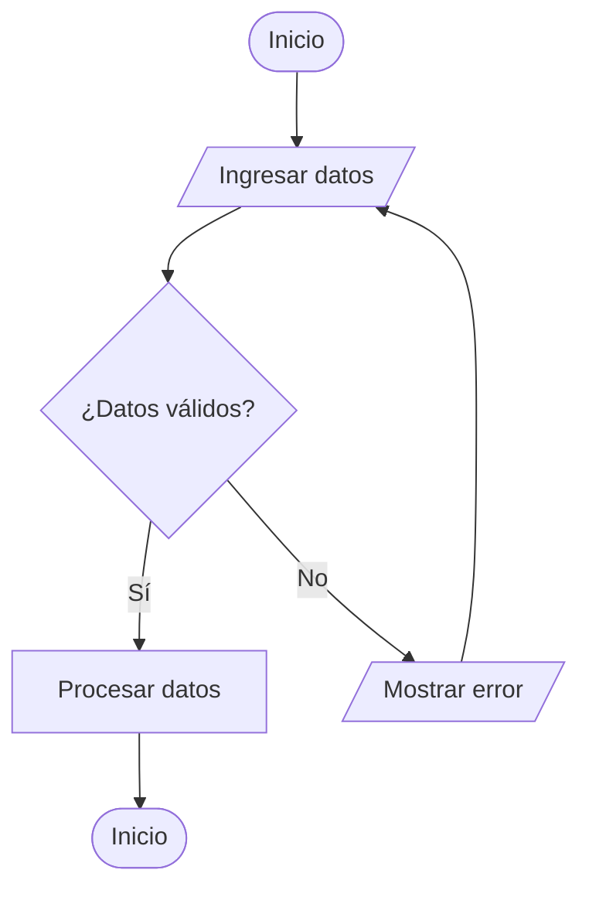

# Diagramas de Flujo en Desarrollo de Software

Los **diagramas de flujo** son herramientas visuales que representan procesos o algoritmos en el desarrollo de software. Permiten entender, analizar y comunicar la lógica de un sistema de manera clara y estructurada.

## Componentes Principales

- **Inicio/Fin:** Indican el punto de inicio y término del proceso. Se representan con óvalos.
- **Acción/Proceso:** Muestran operaciones o instrucciones. Se dibujan como rectángulos.
- **Decisión:** Representan puntos donde el flujo puede tomar diferentes caminos según una condición. Se usan rombos.
- **Entrada/Salida:** Señalan la entrada de datos o la salida de resultados. Se representan con paralelogramos.
- **Flechas:** Indican la dirección del flujo entre los componentes.

## Importancia en el Desarrollo de Software

- Facilitan la comprensión de algoritmos.
- Ayudan en la detección de errores lógicos.
- Mejoran la comunicación entre equipos.
- Sirven como documentación para futuros desarrollos.

## Formas y Usos en Diagramas de Flujo

A continuación se describen las formas más comunes utilizadas en los diagramas de flujo y su propósito:

| Forma            | Descripción                                         | Uso principal                  |
|------------------|-----------------------------------------------------|-------------------------------|
| Óvalo            | Representa el inicio o fin del proceso              | Inicio/Fin                    |
| Rectángulo       | Indica una acción, operación o instrucción          | Acción/Proceso                |
| Rombo            | Señala una decisión o bifurcación en el flujo       | Decisión                      |
| Paralelogramo    | Muestra la entrada o salida de datos                | Entrada/Salida                |
| Flecha           | Indica la dirección del flujo entre los componentes | Dirección del flujo            |

Cada forma ayuda a identificar rápidamente el tipo de operación que se realiza en cada paso del proceso, facilitando la lectura y comprensión del diagrama.
---

**Ejemplo simple:**

---

¡Utiliza diagramas de flujo para mejorar tus proyectos de software!

